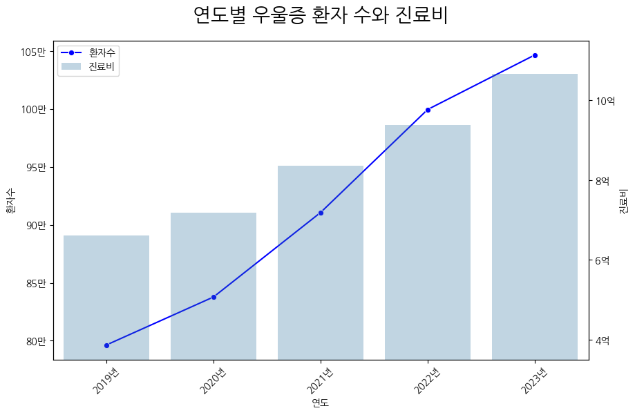
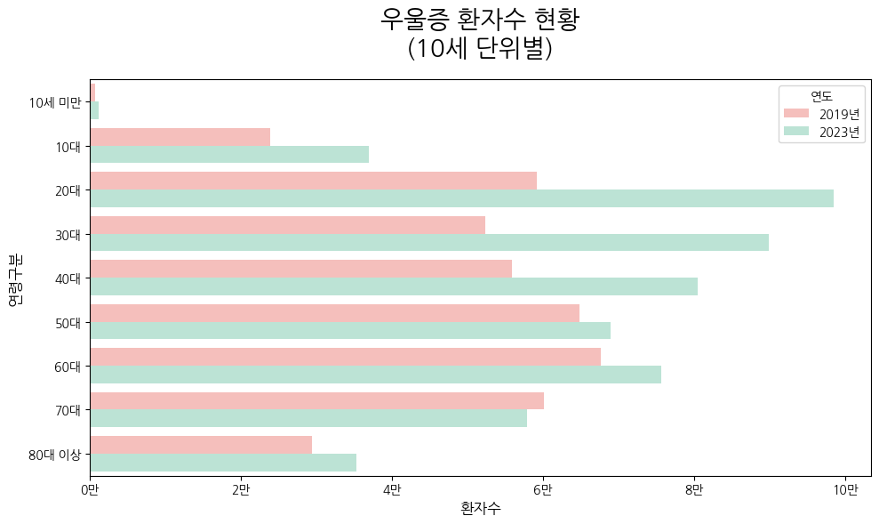

# SKN10-3rd-4Team

3차 단위 프로젝트 - 김현수, 남궁승원, 조현정, 황인호


## (팀명 적기)
### 팀원

| 김현수 | 남궁승원 | 조현정 | 황인호 |
|:----------:|:----------:|:----------:|:----------:|
| aa | bb | cc | dd |
| 11 | 22 | 33 | 44 |

</div>

# 🤖💬 우울증 관련 정보 제공 챗봇 🤖💬

### ✔ 개발 기간                                                  
2025.04.14 ~ 2025.04.15 (총 2일)

## 1. 프로젝트 소개
#### 프로젝트 필요성

- 우울증 환자의 수와 진료비는 매년 증가하고 있으며, 특히 20대에서 급증하는 추세입니다.  
- 정확하고 신뢰할 수 있는 정보 제공은 우울증 인식 개선과 예방에 중요한 역할을 합니다.
<br>




<br><br>
**출처**  
- [[그래픽] 우울증 환자 수·진료비 추이](https://www.yna.co.kr/view/GYH20240110000200044)
- [우울증 환자 5명 중 1명은 ‘20대’...타 연령대 압도](https://www.edaily.co.kr/News/Read?newsId=02046726632365000&mediaCodeNo=257)

## 2. 🎯 프로젝트 목표
- 💬 **질문/답변 기반 상호작용**  
  - 자연어로 질문을 하면 챗봇이 즉시 답변
  - 질문 내용에 따라 다른 방식으로 답변

- 🧠 **우울증 관련 정보 제공**  
  - 증상, 원인, 우울증에 도움이 되는 정보 등 다양한 정신건강 관련 지식 제공

- 📚 **관련 논문 제공 기능**  
  - 사용자의 질문 내용을 분석해 관련된 신뢰도 높은 논문 3편 추천

<br><br>

## 3. 기술 스택 & 사용한 모델 (임베딩 모델, LLM)
### 🧰 기술 스택 및 사용한 모델

- 개발 언어: 
- 개발 환경:     
- 협업 툴 :   
- UI : 
- Vector DB : [](https://github.com/facebookresearch/faiss)

## 4. 📂 프로젝트 구조
```
├── app.py                  # Chainlit 애플리케이션 진입점
├── src                     # 소스 코드
│   ├── rag                 # RAG 모듈
│   │   ├── __init__.py     # RAG 패키지 초기화
│   │   ├── embeddings.py   # 임베딩 로직
│   │   ├── vectorstore.py  # 벡터 저장소 관리
│   │   └── prompts.py      # 프롬프트 템플릿
│   ├── models              # 모델 모듈
│   │   ├── __init__.py     # 모델 패키지 초기화
│   │   ├── llm.py          # LLM 로직
│   │   └── workflow.py     # LangGraph 워크플로우 관리
│   ├── visualization       # 시각화 모듈
│   │   ├── __init__.py     # 시각화 패키지 초기화
│   │   └── graph_visualizer.py # 워크플로우 시각화
│   └── utils               # 유틸리티 함수
│       ├── __init__.py     # 유틸리티 패키지 초기화
│       └── data_loader.py  # 데이터 로딩 및 처리
├── images                  # README용 사진 저장
├── data                    # 데이터 파일 디렉토리
│   └── cleaned_pubmed_papers.csv # 정제된 PubMed 논문 데이터
├── vectors                 # 벡터 파일 디렉토리
│   └── pubmed_vectors      # PubMed 논문 벡터
├── visualization           # 시각화 결과물 디렉토리
│   └── simple_langgraph_workflow.png # 워크플로우 다이어그램
├── chainlit.md            # Chainlit 애플리케이션 문서
├── .env.example            # 환경 변수 예제
├── requirements.txt        # 프로젝트 의존성
├── config.json             # 설정
└── README.md               # 프로젝트 문서
```

## 5. 시스템 아키텍쳐


<br>

## 6. 데이터 소스
### 🎥 유튜브
-  [명쾌한 최원장](https://www.youtube.com/@clearheal)
-  [14F 일사에프](https://www.youtube.com/@14FMBC)
-  [정신과의사 뇌부자들](https://www.youtube.com/@brainrich6)
-  [쿠크닥스 : 멘탈 바사삭 클리닉](https://www.youtube.com/@%EB%A9%98%ED%83%88%EB%B0%94%EC%82%AC%EC%82%AD%ED%81%B4%EB%A6%AC%EB%8B%89/featured)
-  [최명기의 마음 편한 TV](https://www.youtube.com/@%EC%B5%9C%EB%AA%85%EA%B8%B0%EC%9D%98%EB%A7%88%EC%9D%8C%ED%8E%B8%ED%95%9CTV)
<br>

### 📄 논문 데이터
-  [PubMed](https://pubmed.ncbi.nlm.nih.gov/)

<br>

## 7. 데이터 전처리
-  유튜브 url과 연결해서 오디오 추출
```Python
def extract_audio(url):
  yt = YouTube(url, on_progress_callback = on_progress)
  yt.streams.filter(only_audio=True).first().download()
  time.sleep(3)
for url in tqdm(df["video_url"]):
  extract_audio(url)
```

<br><br>
-  추출한 오디오 데이터를 텍스트로 변환
```Python
audio_text_dict = {
  "title" : [],
  "text" : []
}
for audio in tqdm(DATA_LIST):
  # tiny, base, small, medium, large
  model = whisper.load_model("large")
  result = model.transcribe(audio)
  audio_text_dict["title"].append(audio)
  audio_text_dict["text"].append(result["text"])
  print(result["text"])

audio_text_df = pd.DataFrame(audio_text_dict)
```

<br><br>
- 추출한 text에서 불 필요한 부분을 제거
```Python
def summary(text):
  llm = ChatOpenAI(model="gpt-4o-mini")

  summary_prompt_template = """
  한국어, 영어가 아닌 경우 제거해주세요.
  전체 내용을 검토하고, 4문장 길이의 요약해주세요.
  '인삿말'과 '구독 좋아요 알림설정 댓글'과 관련된 내용은 제거해 주세요.
  요약이 내용과 일치하는지 확인하세요.
  한국어 텍스트:
  {content}
  """
```
## 8. Prompt
- classifier
```Python
def classify_question(self, question):
        """
        질문을 학술적인 내용인지 상담 내용인지 분류합니다.
        
        Args:
            question (str): 사용자 질문
            
        Returns:
            str: "academic" 또는 "counseling"
        """
        prompt = """
        다음 질문이 우울증에 대한 학술적/연구적 내용을 묻는 것인지, 
        아니면 우울증 관련 상담이나 개인적인 조언을 구하는 것인지 판단해주세요.
        
        질문: {question}
        
        분류 기준:
        - '학술적(academic)': 우울증의 원인, 증상, 치료법, 통계, 연구 결과, 약물, 치료법 등 객관적 정보를 요청하는 경우
        - '상담(counseling)': 개인적인 우울함, 감정적 어려움, 심리적 조언, 대처 방법 등을 구하는 경우
        
        다음 중 하나로만 응답해 주세요: 'academic' 또는 'counseling'
        """.format(question=question)
```
<br><br>
- Counselor
```Python
def create_counseling_prompt(self, question):
        """
        상담 질문에 대한 프롬프트를 생성합니다.
        """
        template = """
        당신은 우울증 상담 전문가입니다. 사용자의 우울한 감정과 고민에 공감하고 도움이 되는 조언을 제공해 주세요.

        사용자 메시지: {question}

        상담 지침:
        1. 사용자의 감정에 충분히 공감하세요
        2. 판단하지 말고 경청하는 태도를 보여주세요
        3. 구체적이고 실행 가능한 조언을 제공하세요
        4. 필요하다면 전문적인 상담을 권유하세요
        5. 단, 의학적 진단이나 처방은 제공하지 마세요
        6. 자살/자해 관련 내용이 언급되면 즉시 전문가 상담을 권유하세요

        따뜻하고 공감적인 한국어로 응답해 주세요.
        """

        return template.format(question=question)
```
<br><br>
- Researcher
```Python
def create_prompt(self, question, context):
        template = """
        당신은 정신의학 전문가입니다. 제공된 PubMed 논문들 중에서 질문과 가장 관련성이 높은 논문들만 선별하여 답변해 주세요.

        질문: {question}

        참고할 논문 내용:
        {context}

        답변 작성 과정:
        1. 제공된 논문들 중 질문과 직접적인 관련이 있는 논문들만 선별하세요
        2. 관련성이 낮거나 질문에 도움이 되지 않는 논문은 분석에서 제외하세요
        3. 선별한 논문들의 정보를 종합하여 하나의 일관된 답변을 작성하세요

        답변 작성 지침:
        1. 답변 시작 부분에 어떤 논문들이 가장 관련성이 높았는지 간략히 언급하세요
        2. 선별한 논문들 간의 공통점과 차이점을 파악하여 분석하세요
        3. 각 논문의 핵심 발견과 결론을 통합적으로 설명하세요
        4. 답변 내용을 명확하게 설명하고 논리적으로 구성하세요
        5. 선별한 논문 정보를 반드시 언급하세요 (제목, 저널)
        6. 정보가 불충분하거나 논문 간 상충되는 내용이 있는 경우 정직하게 인정하세요

        한국어로 명확하고 전문적인 답변을 제공해 주세요.
        """

        return template.format(question=question, context=context)
```
## 9. 결과
- Counselor ver.


<br><br>
- Reseracher ver


<br><br>
- LangGraph


## 10. 회고록
- 김현수👑👍: 
- 남궁승원: 조원 분들은 신이고, 나는 탈주가 하고 싶었다.
- 조현정👑👍:
- 황인호👑👍: